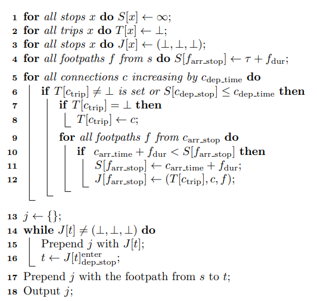

# learning-pt-routing
This is an environment to learn and implement the Connection Scan Algorithm [[1]](#1) in Python.

The project is prepared in such a way that the implementation of the core algorithm, 
which is only a few lines long, can be started directly.
In particular, you do not have to do time-consuming preparatory work such 
as implementing a timetable data parser or creating suitable data structures, 
but you can start implementing the core algorithm immediately.

## Tasks

The goal is that you implement the following three variants of the 
Connection Scan Algorithm in the class ```scripts.connectionscan_router.ConnectionScanCore```.

#### Task 1: Unoptimized earliest arrival
Implement the following algorithm (figure 3 on page 7 of [[1]](#1)) in the function ```route_earliest_arrival```:


#### Task 2: Unoptimized earliest arrival with reconstruction
Implement the following algorithm (figure 6 on page 10 of [[1]](#1)) in the function ```route_earliest_arrival_with_reconstruction```:



#### Task 3: Optimized earliest arrival with reconstruction
Implement the following algorithm (figure 4 on page 8 of [[1]](#1)) in the function ```route_optimized_earliest_arrival_with_reconstruction```:


## How to proceed
The following software should be installed on your computer:
- [Python 3.7 (64-bit)](https://www.python.org/downloads/release/python-376/) 
- [git](https://git-scm.com/downloads)
- A powerful text editor (i.e. [Sublime Text](https://www.sublimetext.com/])) or 
IDE (i.e. [Visual Studio Code](https://code.visualstudio.com/) or 
[PyCharm](https://www.jetbrains.com/de-de/pycharm/)) for developing

### Installation
* Choose a folder where you want to place your development folder 
and a folder where you want to place your virtual environment folder 
* Create the virtual environment:
   - Open a command line, navigate to the folder where you want to place your virtual environment
   - Create the virtual environment with ```path/to/your/python/3.7/installation/python.exe -m venv YOUR_NAME_OF_THE_VENV```.
   - Activate the virtual environment with ```YOUR_NAME_OF_THE_VENV/Scripts/activate```
* Install the project:
   - Navigate to the folder where you want to place the development folder
   - Clone the project with ```git clone https://github.com/jlieberherr/learning-pt-routing.git```
   - Navigate to the now created development folder with ```cd learning-pt-routing```
   - Install the necessary python packages 
(the virtual environment must be activated) with ```pip install -r requirements.txt```
   - Run the default tests with ```pytest tests/a_default```. 
   If you run all tests (with ```pytest```) all tests in ```tests/b_router``` will fail. Your task is to make them green.
* Create your branch and start coding:
   - Create your new branch with ```git branch NAME_OF_YOUR_NEW_BRANCH```
   - Checkout your new branch with ```git checkout NAME_OF_YOUR_NEW_BRANCH```
   - Implement the three tasks in ```scripts.connectionscan_router.ConnectionScanCore```. 
   You can test your implementation per task with ```pytest tests/task_1```, ```pytest tests/task_2``` and
    ```pytest tests/task_3``` or all tests together with ```pytest```.
* Apply your implementation of the Connection Scan Algorithm on real world public transport networks:
   - Choose a [gtfs](https://developers.google.com/transit/gtfs/reference) feed from your preferred country or city, 
   for example from [transitfeeds.com](https://transitfeeds.com/)
   - Start Jupyter Lab from the development folder (the virtual environment must be activated) with ```jupyter lab``` 
   (note that with Python 3.8 this may not work without workaround, 
   see [here](https://github.com/jupyter/notebook/issues/4613) - 
   this is why we use Python 3.7 for the project)
   - Make a copy of the Jupyter notebook ```notebooks/route_on_real_world_gtfs.ipynb```
   - Link the chosen gtfs-feed in the notebook, parse it into a ```ConnectionScanCore``` object
   and run your implementation of the Connection Scan Algorithm on your preferred source-target-stop-relations. Are
   the results as expected? Does the optimization in task 3 improve the runtime?
   - Hint: In ```notebooks/route_on_real_world_gtfs.ipynb``` the download, parsing and some routing queries for 
   Switzerland, Paris, New York subway and Madrid is already prepared. You can also start with this if you don't have a 
   preferred gtfs feed. Note that you need an internet-connection to download the gtfs-data and more than 1.5 GB of 
   memory to load the gtfs-data into memory.


## Prerequisites
To successfully complete the tasks you need some experience with algorithms and a solid 
understanding of Python. Especially you should be familiar with loops, 
if-else-statements and the typical data structures in Python (such as ```list```, ```dict```, ```tuple```, 
```class```, ...).

You should also have a basic understanding of the source control system [git](https://git-scm.com/), 
unit tests with [pytest](https://docs.pytest.org/en/latest/index.html), [Jupyter notebooks](https://jupyter.org/) 
, [virtual environments](https://docs.python.org/3/tutorial/venv.html) in Python and command line interaction.


## References
<a id="1">[1]</a> 
Julian Dibbelt, Thomas Pajor, Ben Strasser, Dorothea Wagner (2017). 
Connection Scan Algorithm. Available at https://arxiv.org/pdf/1703.05997.pdf
