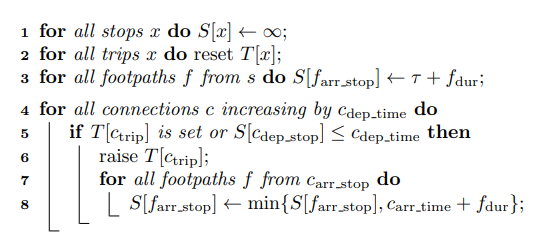
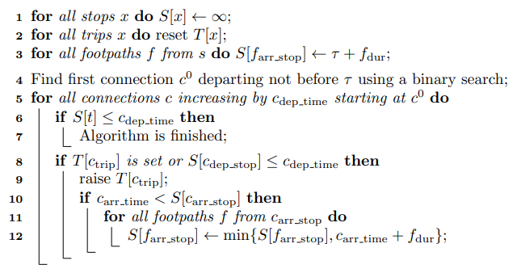

# learning-pt-routing
This is an environment to learn and implement the Connection Scan Algorithm [[1]](#1).

The project is prepared in such a way that the implementation of the core algorithm, 
which is only a few lines long, can be started directly.
In particular, this means that you do not have to do time-consuming preparatory work such 
as implementing a timetable data parser or creating suitable data structures, 
but can start implementing the core algorithm immediately.

## Tasks

The goal is that you implement the following three variants of the 
connection scan algorithm in the class ```scripts.connectionscan_router.ConnectionScanCore```.

#### 1. Unoptimized earliest arrival
Implement the following algorithm (figure 3 on page 7 of [[1]](#1)) in the function ```route_earliest_arrival```:



#### 2. Unoptimized earliest arrival with reconstruction
Implement the following algorithm (figure 6 on page 10 of [[1]](#1)) in the function ```route_earliest_arrival_with_reconstruction```:


#### 3. Optimized earliest arrival with reconstruction
Implement the following algorithm (figure 4 on page 8 of [[1]](#1)) in the function ```route_optimized_earliest_arrival_with_reconstruction```:



### Test your implementation
The following tests are available to check your implementations:
* Unoptimized earliest arrival: ```TODO```
* Unoptimized earliest arrival with reconstruction: ```TODO```
* Optimized earliest arrival with reconstruction: ```TODO```

### Apply your implementation on real world gtfs-data
Once all tests are green, you can apply your implementation 
to any [gtfs](https://developers.google.com/transit/gtfs/reference) data. 
For this you can use the Jupyter notebook ```notebooks/route_on_real_world_gtfs.ipynb```.
gtfs is the de facto standard for timetable data. On https://transitfeeds.com/ you can download gtfs-files 
for various cities or countries around the world.


## Prerequisites
To successfully complete the tasks you need some experience with algorithms on the one hand and a basic 
understanding of Python on the other hand. Especially you should be familiar with loops, 
if-else-statements and the following data Python structures: ```list```, ```dict```, ```tuple", ```class```, ...

It is also very helpful if you are already familiar with the source control system [git](https://git-scm.com/), 
unit tests with [pytest](https://docs.pytest.org/en/latest/index.html), [Jupyter notebooks](https://jupyter.org/) 
, [virtual environments](https://docs.python.org/3/tutorial/venv.html) in Python and basic command line interaction.

## Installation
We assume that the following software is installed on your computer:
- [Python 3.8 (64-bit)](https://www.python.org/downloads/release/python-381/.)
- [git](https://git-scm.com/downloads)
- A powerful text editor (i.e. (Sublime Text)[https://www.sublimetext.com/]) or 
IDE (i.e. [Visual Studio Code](https://code.visualstudio.com/) or 
[PyCharm](https://www.jetbrains.com/de-de/pycharm/)) for developing the code.

To install the project execute the following steps:
* Choose a folder for development and a folder for the virtual environment 
* Create the virtual environment:
   - Open a command line, navigate to the folder for the virtual environment
   - Create the virtual environment with ```py -m venv NAME_OF_THE_VENV```
   - Activate the virtual environment with ```NAME_OF_THE_VENV/Scripts/activate``` 
(depending on the platform this might be slightly different)
   - Assure that the virtual environment is running with the correct Python interpreter
* Install the project:
   - Navigate to the folder for development
   - Download the project with ```git clone https://github.com/jlieberherr/learning-pt-routing.git```
   - Install the necessary python packages 
(the virtual environment must be activated): ```pip install -r requirements.txt```
   - Run the relevant tests in the ```master``` branch: ```pytest TODO```
* Create your branch and start coding:
   - If all tests are green create your new branch: ```git branch NAME_OF_YOUR_NEW_BRANCH```
   - Checkout your new branch ```git checkout NAME_OF_YOUR_NEW_BRANCH```
   - Start your implementation until all tests are green: ```git pytest```


## References
<a id="1">[1]</a> 
Julian Dibbelt, Thomas Pajor, Ben Strasser, Dorothea Wagner (2017). 
Connection Scan Algorithm. Available at https://arxiv.org/pdf/1703.05997.pdf
